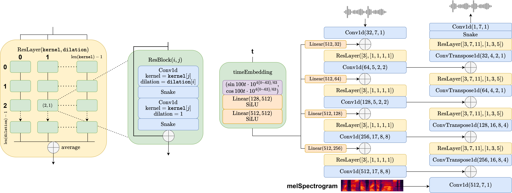

Flow matching offers a robust and stable approach to training diffusion models. However, directly applying flow matching to neural vocoders can result in subpar audio quality. In this work, we present WaveFM, a reparameterized flow matching model for mel-spectrogram conditioned speech synthesis, designed to enhance both sample quality and generation speed for diffusion vocoders. Since mel-spectrograms represent the energy distribution of waveforms, WaveFM adopts a mel-conditioned prior distribution instead of a standard Gaussian prior to minimize unnecessary transportation costs during synthesis. Moreover, while most diffusion vocoders rely on a single loss function, we argue that incorporating auxiliary losses, including a refined multi-resolution STFT loss, can further improve audio quality. To speed up inference without degrading sample quality significantly, we introduce a tailored consistency distillation method for WaveFM. Experimental results demonstrate that our model achieves superior performance in both quality and efficiency compared to previous diffusion vocoders, while enabling waveform generation in a single inference step.

# Model

The total amount of parameters is `19.5M`. The 128-dim time embedding is expanded to 512-dim after two linear-SiLU layers, and is then reshaped to the desired shape of each resolution. `Conv1d` and `ConvTranspose1d` are set with parameters `(output channel, kernel width, dilation, padding)`. In ResBlock `Conv1d` takes same padding. Each ResLayer is defined with a kernel list and a dilation list, and their cross-product of define the shape of the ResBlock matrix and the convolutional layers of each ResBlock. On the left column are downsampling ResLayers, each containing a `4 x 1` ResBlock matrix, while on the right columns are upsampling ResLayers, each containing a `3 x 3` ResBlock matrix, following the structure from HifiGAN. In each ResBlock the number of channels is unchanged.

For detailed parameter settings please refer to `WaveFM/src/params.py`.

# Audio Samples

<table><thead><tr><td align="center"><b>Ground</b> <b>Truth</b></td>
<td align="center"><b>WaveFM</b> <b>(6 steps)</b></td>
<td align="center"><b>WaveFM</b> <b>(1 step)</b></td>
<td align="center"><b>BigVGAN</b> <b>(6 steps)</b></td>
<td align="center"><b>HifiGAN</b> <b>(6 steps)</b></td>
<td align="center"><b>DiffWave</b> <b>(6 steps)</b></td>
<td align="center"><b>PriorGrad</b> <b>(6 steps)</b></td>
<td align="center"><b>FreGrad</b> <b>(6 steps)</b></td>
<td align="center"><b>FastDiff</b> <b>(6 steps)</b></td></tr></thead><tbody>
<tbody><tr><td colspan="9">Music 1</td></tr></tbody><tbody><tr>
<td align="center"><audio id="player" controls="" style="width:100px;" preload="auto"><source src="audio\Ground_Truth\Alexander_Ross_-_Goodbye_Bolero.wav"></audio></td>
<td align="center"><audio id="player" controls="" style="width:100px;" preload="auto"><source src="audio\WaveFM_(6_steps)\Alexander_Ross_-_Goodbye_Bolero.wav"></audio></td>
<td align="center"><audio id="player" controls="" style="width:100px;" preload="auto"><source src="audio\WaveFM_(1_step)\Alexander_Ross_-_Goodbye_Bolero.wav"></audio></td>
<td align="center"><audio id="player" controls="" style="width:100px;" preload="auto"><source src="audio\BigVGAN_(6_steps)\Alexander_Ross_-_Goodbye_Bolero.wav"></audio></td>
<td align="center"><audio id="player" controls="" style="width:100px;" preload="auto"><source src="audio\HifiGAN_(6_steps)\Alexander_Ross_-_Goodbye_Bolero.wav"></audio></td>
<td align="center"><audio id="player" controls="" style="width:100px;" preload="auto"><source src="audio\DiffWave_(6_steps)\Alexander_Ross_-_Goodbye_Bolero.wav"></audio></td>
<td align="center"><audio id="player" controls="" style="width:100px;" preload="auto"><source src="audio\PriorGrad_(6_steps)\Alexander_Ross_-_Goodbye_Bolero.wav"></audio></td>
<td align="center"><audio id="player" controls="" style="width:100px;" preload="auto"><source src="audio\FreGrad_(6_steps)\Alexander_Ross_-_Goodbye_Bolero.wav"></audio></td>
<td align="center"><audio id="player" controls="" style="width:100px;" preload="auto"><source src="audio\FastDiff_(6_steps)\Alexander_Ross_-_Goodbye_Bolero.wav"></audio></td>
</tr></tbody><tbody><tr><td colspan="9">Music 2</td></tr></tbody><tbody><tr>
<td align="center"><audio id="player" controls="" style="width:100px;" preload="auto"><source src="audio\Ground_Truth\Al_James_-_Schoolboy_Facination.wav"></audio></td>
<td align="center"><audio id="player" controls="" style="width:100px;" preload="auto"><source src="audio\WaveFM_(6_steps)\Al_James_-_Schoolboy_Facination.wav"></audio></td>
<td align="center"><audio id="player" controls="" style="width:100px;" preload="auto"><source src="audio\WaveFM_(1_step)\Al_James_-_Schoolboy_Facination.wav"></audio></td>
<td align="center"><audio id="player" controls="" style="width:100px;" preload="auto"><source src="audio\BigVGAN_(6_steps)\Al_James_-_Schoolboy_Facination.wav"></audio></td>
<td align="center"><audio id="player" controls="" style="width:100px;" preload="auto"><source src="audio\HifiGAN_(6_steps)\Al_James_-_Schoolboy_Facination.wav"></audio></td>
<td align="center"><audio id="player" controls="" style="width:100px;" preload="auto"><source src="audio\DiffWave_(6_steps)\Al_James_-_Schoolboy_Facination.wav"></audio></td>
<td align="center"><audio id="player" controls="" style="width:100px;" preload="auto"><source src="audio\PriorGrad_(6_steps)\Al_James_-_Schoolboy_Facination.wav"></audio></td>
<td align="center"><audio id="player" controls="" style="width:100px;" preload="auto"><source src="audio\FreGrad_(6_steps)\Al_James_-_Schoolboy_Facination.wav"></audio></td>
<td align="center"><audio id="player" controls="" style="width:100px;" preload="auto"><source src="audio\FastDiff_(6_steps)\Al_James_-_Schoolboy_Facination.wav"></audio></td>
</tr></tbody><tbody><tr><td colspan="9">Music 3</td></tr></tbody><tbody><tr>
<td align="center"><audio id="player" controls="" style="width:100px;" preload="auto"><source src="audio\Ground_Truth\Ben_Carrigan_-_We'll_Talk_About_It_All_Tonight.wav"></audio></td>
<td align="center"><audio id="player" controls="" style="width:100px;" preload="auto"><source src="audio\WaveFM_(6_steps)\Ben_Carrigan_-_We'll_Talk_About_It_All_Tonight.wav"></audio></td>
<td align="center"><audio id="player" controls="" style="width:100px;" preload="auto"><source src="audio\WaveFM_(1_step)\Ben_Carrigan_-_We'll_Talk_About_It_All_Tonight.wav"></audio></td>
<td align="center"><audio id="player" controls="" style="width:100px;" preload="auto"><source src="audio\BigVGAN_(6_steps)\Ben_Carrigan_-_We'll_Talk_About_It_All_Tonight.wav"></audio></td>
<td align="center"><audio id="player" controls="" style="width:100px;" preload="auto"><source src="audio\HifiGAN_(6_steps)\Ben_Carrigan_-_We'll_Talk_About_It_All_Tonight.wav"></audio></td>
<td align="center"><audio id="player" controls="" style="width:100px;" preload="auto"><source src="audio\DiffWave_(6_steps)\Ben_Carrigan_-_We'll_Talk_About_It_All_Tonight.wav"></audio></td>
<td align="center"><audio id="player" controls="" style="width:100px;" preload="auto"><source src="audio\PriorGrad_(6_steps)\Ben_Carrigan_-_We'll_Talk_About_It_All_Tonight.wav"></audio></td>
<td align="center"><audio id="player" controls="" style="width:100px;" preload="auto"><source src="audio\FreGrad_(6_steps)\Ben_Carrigan_-_We'll_Talk_About_It_All_Tonight.wav"></audio></td>
<td align="center"><audio id="player" controls="" style="width:100px;" preload="auto"><source src="audio\FastDiff_(6_steps)\Ben_Carrigan_-_We'll_Talk_About_It_All_Tonight.wav"></audio></td>
</tr></tbody><tbody><tr><td colspan="9">Music 4</td></tr></tbody><tbody><tr>
<td align="center"><audio id="player" controls="" style="width:100px;" preload="auto"><source src="audio\Ground_Truth\BKS_-_Too_Much.wav"></audio></td>
<td align="center"><audio id="player" controls="" style="width:100px;" preload="auto"><source src="audio\WaveFM_(6_steps)\BKS_-_Too_Much.wav"></audio></td>
<td align="center"><audio id="player" controls="" style="width:100px;" preload="auto"><source src="audio\WaveFM_(1_step)\BKS_-_Too_Much.wav"></audio></td>
<td align="center"><audio id="player" controls="" style="width:100px;" preload="auto"><source src="audio\BigVGAN_(6_steps)\BKS_-_Too_Much.wav"></audio></td>
<td align="center"><audio id="player" controls="" style="width:100px;" preload="auto"><source src="audio\HifiGAN_(6_steps)\BKS_-_Too_Much.wav"></audio></td>
<td align="center"><audio id="player" controls="" style="width:100px;" preload="auto"><source src="audio\DiffWave_(6_steps)\BKS_-_Too_Much.wav"></audio></td>
<td align="center"><audio id="player" controls="" style="width:100px;" preload="auto"><source src="audio\PriorGrad_(6_steps)\BKS_-_Too_Much.wav"></audio></td>
<td align="center"><audio id="player" controls="" style="width:100px;" preload="auto"><source src="audio\FreGrad_(6_steps)\BKS_-_Too_Much.wav"></audio></td>
<td align="center"><audio id="player" controls="" style="width:100px;" preload="auto"><source src="audio\FastDiff_(6_steps)\BKS_-_Too_Much.wav"></audio></td>
</tr></tbody><tbody><tr><td colspan="9">Music 5</td></tr></tbody><tbody><tr>
<td align="center"><audio id="player" controls="" style="width:100px;" preload="auto"><source src="audio\Ground_Truth\Zeno_-_Signs.wav"></audio></td>
<td align="center"><audio id="player" controls="" style="width:100px;" preload="auto"><source src="audio\WaveFM_(6_steps)\Zeno_-_Signs.wav"></audio></td>
<td align="center"><audio id="player" controls="" style="width:100px;" preload="auto"><source src="audio\WaveFM_(1_step)\Zeno_-_Signs.wav"></audio></td>
<td align="center"><audio id="player" controls="" style="width:100px;" preload="auto"><source src="audio\BigVGAN_(6_steps)\Zeno_-_Signs.wav"></audio></td>
<td align="center"><audio id="player" controls="" style="width:100px;" preload="auto"><source src="audio\HifiGAN_(6_steps)\Zeno_-_Signs.wav"></audio></td>
<td align="center"><audio id="player" controls="" style="width:100px;" preload="auto"><source src="audio\DiffWave_(6_steps)\Zeno_-_Signs.wav"></audio></td>
<td align="center"><audio id="player" controls="" style="width:100px;" preload="auto"><source src="audio\PriorGrad_(6_steps)\Zeno_-_Signs.wav"></audio></td>
<td align="center"><audio id="player" controls="" style="width:100px;" preload="auto"><source src="audio\FreGrad_(6_steps)\Zeno_-_Signs.wav"></audio></td>
<td align="center"><audio id="player" controls="" style="width:100px;" preload="auto"><source src="audio\FastDiff_(6_steps)\Zeno_-_Signs.wav"></audio></td>
</tr></tbody><tbody><tr><td colspan="9">Bass</td></tr></tbody><tbody><tr>
<td align="center"><audio id="player" controls="" style="width:100px;" preload="auto"><source src="audio\Ground_Truth\AM_Contra_-_Heart_Peripheral.wav"></audio></td>
<td align="center"><audio id="player" controls="" style="width:100px;" preload="auto"><source src="audio\WaveFM_(6_steps)\AM_Contra_-_Heart_Peripheral.wav"></audio></td>
<td align="center"><audio id="player" controls="" style="width:100px;" preload="auto"><source src="audio\WaveFM_(1_step)\AM_Contra_-_Heart_Peripheral.wav"></audio></td>
<td align="center"><audio id="player" controls="" style="width:100px;" preload="auto"><source src="audio\BigVGAN_(6_steps)\AM_Contra_-_Heart_Peripheral.wav"></audio></td>
<td align="center"><audio id="player" controls="" style="width:100px;" preload="auto"><source src="audio\HifiGAN_(6_steps)\AM_Contra_-_Heart_Peripheral.wav"></audio></td>
<td align="center"><audio id="player" controls="" style="width:100px;" preload="auto"><source src="audio\DiffWave_(6_steps)\AM_Contra_-_Heart_Peripheral.wav"></audio></td>
<td align="center"><audio id="player" controls="" style="width:100px;" preload="auto"><source src="audio\PriorGrad_(6_steps)\AM_Contra_-_Heart_Peripheral.wav"></audio></td>
<td align="center"><audio id="player" controls="" style="width:100px;" preload="auto"><source src="audio\FreGrad_(6_steps)\AM_Contra_-_Heart_Peripheral.wav"></audio></td>
<td align="center"><audio id="player" controls="" style="width:100px;" preload="auto"><source src="audio\FastDiff_(6_steps)\AM_Contra_-_Heart_Peripheral.wav"></audio></td>
</tr></tbody><tbody><tr><td colspan="9">Drum</td></tr></tbody><tbody><tr>
<td align="center"><audio id="player" controls="" style="width:100px;" preload="auto"><source src="audio\Ground_Truth\Actions_-_One_Minute_Smile.wav"></audio></td>
<td align="center"><audio id="player" controls="" style="width:100px;" preload="auto"><source src="audio\WaveFM_(6_steps)\Actions_-_One_Minute_Smile.wav"></audio></td>
<td align="center"><audio id="player" controls="" style="width:100px;" preload="auto"><source src="audio\WaveFM_(1_step)\Actions_-_One_Minute_Smile.wav"></audio></td>
<td align="center"><audio id="player" controls="" style="width:100px;" preload="auto"><source src="audio\BigVGAN_(6_steps)\Actions_-_One_Minute_Smile.wav"></audio></td>
<td align="center"><audio id="player" controls="" style="width:100px;" preload="auto"><source src="audio\HifiGAN_(6_steps)\Actions_-_One_Minute_Smile.wav"></audio></td>
<td align="center"><audio id="player" controls="" style="width:100px;" preload="auto"><source src="audio\DiffWave_(6_steps)\Actions_-_One_Minute_Smile.wav"></audio></td>
<td align="center"><audio id="player" controls="" style="width:100px;" preload="auto"><source src="audio\PriorGrad_(6_steps)\Actions_-_One_Minute_Smile.wav"></audio></td>
<td align="center"><audio id="player" controls="" style="width:100px;" preload="auto"><source src="audio\FreGrad_(6_steps)\Actions_-_One_Minute_Smile.wav"></audio></td>
<td align="center"><audio id="player" controls="" style="width:100px;" preload="auto"><source src="audio\FastDiff_(6_steps)\Actions_-_One_Minute_Smile.wav"></audio></td>
</tr></tbody><tbody><tr><td colspan="9">Vocal</td></tr></tbody><tbody><tr>
<td align="center"><audio id="player" controls="" style="width:100px;" preload="auto"><source src="audio\Ground_Truth\Clara_Berry_And_Wooldog_-_Waltz_For_My_Victims.wav"></audio></td>
<td align="center"><audio id="player" controls="" style="width:100px;" preload="auto"><source src="audio\WaveFM_(6_steps)\Clara_Berry_And_Wooldog_-_Waltz_For_My_Victims.wav"></audio></td>
<td align="center"><audio id="player" controls="" style="width:100px;" preload="auto"><source src="audio\WaveFM_(1_step)\Clara_Berry_And_Wooldog_-_Waltz_For_My_Victims.wav"></audio></td>
<td align="center"><audio id="player" controls="" style="width:100px;" preload="auto"><source src="audio\BigVGAN_(6_steps)\Clara_Berry_And_Wooldog_-_Waltz_For_My_Victims.wav"></audio></td>
<td align="center"><audio id="player" controls="" style="width:100px;" preload="auto"><source src="audio\HifiGAN_(6_steps)\Clara_Berry_And_Wooldog_-_Waltz_For_My_Victims.wav"></audio></td>
<td align="center"><audio id="player" controls="" style="width:100px;" preload="auto"><source src="audio\DiffWave_(6_steps)\Clara_Berry_And_Wooldog_-_Waltz_For_My_Victims.wav"></audio></td>
<td align="center"><audio id="player" controls="" style="width:100px;" preload="auto"><source src="audio\PriorGrad_(6_steps)\Clara_Berry_And_Wooldog_-_Waltz_For_My_Victims.wav"></audio></td>
<td align="center"><audio id="player" controls="" style="width:100px;" preload="auto"><source src="audio\FreGrad_(6_steps)\Clara_Berry_And_Wooldog_-_Waltz_For_My_Victims.wav"></audio></td>
<td align="center"><audio id="player" controls="" style="width:100px;" preload="auto"><source src="audio\FastDiff_(6_steps)\Clara_Berry_And_Wooldog_-_Waltz_For_My_Victims.wav"></audio></td>
</tr></tbody><tbody><tr><td colspan="9">Others</td></tr></tbody><tbody><tr>
<td align="center"><audio id="player" controls="" style="width:100px;" preload="auto"><source src="audio\Ground_Truth\BKS_-_Bulldozer.wav"></audio></td>
<td align="center"><audio id="player" controls="" style="width:100px;" preload="auto"><source src="audio\WaveFM_(6_steps)\BKS_-_Bulldozer.wav"></audio></td>
<td align="center"><audio id="player" controls="" style="width:100px;" preload="auto"><source src="audio\WaveFM_(1_step)\BKS_-_Bulldozer.wav"></audio></td>
<td align="center"><audio id="player" controls="" style="width:100px;" preload="auto"><source src="audio\BigVGAN_(6_steps)\BKS_-_Bulldozer.wav"></audio></td>
<td align="center"><audio id="player" controls="" style="width:100px;" preload="auto"><source src="audio\HifiGAN_(6_steps)\BKS_-_Bulldozer.wav"></audio></td>
<td align="center"><audio id="player" controls="" style="width:100px;" preload="auto"><source src="audio\DiffWave_(6_steps)\BKS_-_Bulldozer.wav"></audio></td>
<td align="center"><audio id="player" controls="" style="width:100px;" preload="auto"><source src="audio\PriorGrad_(6_steps)\BKS_-_Bulldozer.wav"></audio></td>
<td align="center"><audio id="player" controls="" style="width:100px;" preload="auto"><source src="audio\FreGrad_(6_steps)\BKS_-_Bulldozer.wav"></audio></td>
<td align="center"><audio id="player" controls="" style="width:100px;" preload="auto"><source src="audio\FastDiff_(6_steps)\BKS_-_Bulldozer.wav"></audio></td>
</tr></tbody><tbody><tr><td colspan="9">Male 1</td></tr></tbody><tbody><tr>
<td align="center"><audio id="player" controls="" style="width:100px;" preload="auto"><source src="audio\Ground_Truth\1089_134686_000007_000005.wav"></audio></td>
<td align="center"><audio id="player" controls="" style="width:100px;" preload="auto"><source src="audio\WaveFM_(6_steps)\1089_134686_000007_000005.wav"></audio></td>
<td align="center"><audio id="player" controls="" style="width:100px;" preload="auto"><source src="audio\WaveFM_(1_step)\1089_134686_000007_000005.wav"></audio></td>
<td align="center"><audio id="player" controls="" style="width:100px;" preload="auto"><source src="audio\BigVGAN_(6_steps)\1089_134686_000007_000005.wav"></audio></td>
<td align="center"><audio id="player" controls="" style="width:100px;" preload="auto"><source src="audio\HifiGAN_(6_steps)\1089_134686_000007_000005.wav"></audio></td>
<td align="center"><audio id="player" controls="" style="width:100px;" preload="auto"><source src="audio\DiffWave_(6_steps)\1089_134686_000007_000005.wav"></audio></td>
<td align="center"><audio id="player" controls="" style="width:100px;" preload="auto"><source src="audio\PriorGrad_(6_steps)\1089_134686_000007_000005.wav"></audio></td>
<td align="center"><audio id="player" controls="" style="width:100px;" preload="auto"><source src="audio\FreGrad_(6_steps)\1089_134686_000007_000005.wav"></audio></td>
<td align="center"><audio id="player" controls="" style="width:100px;" preload="auto"><source src="audio\FastDiff_(6_steps)\1089_134686_000007_000005.wav"></audio></td>
</tr></tbody><tbody><tr><td colspan="9">Male 2</td></tr></tbody><tbody><tr>
<td align="center"><audio id="player" controls="" style="width:100px;" preload="auto"><source src="audio\Ground_Truth\1089_134686_000024_000007.wav"></audio></td>
<td align="center"><audio id="player" controls="" style="width:100px;" preload="auto"><source src="audio\WaveFM_(6_steps)\1089_134686_000024_000007.wav"></audio></td>
<td align="center"><audio id="player" controls="" style="width:100px;" preload="auto"><source src="audio\WaveFM_(1_step)\1089_134686_000024_000007.wav"></audio></td>
<td align="center"><audio id="player" controls="" style="width:100px;" preload="auto"><source src="audio\BigVGAN_(6_steps)\1089_134686_000024_000007.wav"></audio></td>
<td align="center"><audio id="player" controls="" style="width:100px;" preload="auto"><source src="audio\HifiGAN_(6_steps)\1089_134686_000024_000007.wav"></audio></td>
<td align="center"><audio id="player" controls="" style="width:100px;" preload="auto"><source src="audio\DiffWave_(6_steps)\1089_134686_000024_000007.wav"></audio></td>
<td align="center"><audio id="player" controls="" style="width:100px;" preload="auto"><source src="audio\PriorGrad_(6_steps)\1089_134686_000024_000007.wav"></audio></td>
<td align="center"><audio id="player" controls="" style="width:100px;" preload="auto"><source src="audio\FreGrad_(6_steps)\1089_134686_000024_000007.wav"></audio></td>
<td align="center"><audio id="player" controls="" style="width:100px;" preload="auto"><source src="audio\FastDiff_(6_steps)\1089_134686_000024_000007.wav"></audio></td>
</tr></tbody><tbody><tr><td colspan="9">Male 3</td></tr></tbody><tbody><tr>
<td align="center"><audio id="player" controls="" style="width:100px;" preload="auto"><source src="audio\Ground_Truth\1188_133604_000011_000003.wav"></audio></td>
<td align="center"><audio id="player" controls="" style="width:100px;" preload="auto"><source src="audio\WaveFM_(6_steps)\1188_133604_000011_000003.wav"></audio></td>
<td align="center"><audio id="player" controls="" style="width:100px;" preload="auto"><source src="audio\WaveFM_(1_step)\1188_133604_000011_000003.wav"></audio></td>
<td align="center"><audio id="player" controls="" style="width:100px;" preload="auto"><source src="audio\BigVGAN_(6_steps)\1188_133604_000011_000003.wav"></audio></td>
<td align="center"><audio id="player" controls="" style="width:100px;" preload="auto"><source src="audio\HifiGAN_(6_steps)\1188_133604_000011_000003.wav"></audio></td>
<td align="center"><audio id="player" controls="" style="width:100px;" preload="auto"><source src="audio\DiffWave_(6_steps)\1188_133604_000011_000003.wav"></audio></td>
<td align="center"><audio id="player" controls="" style="width:100px;" preload="auto"><source src="audio\PriorGrad_(6_steps)\1188_133604_000011_000003.wav"></audio></td>
<td align="center"><audio id="player" controls="" style="width:100px;" preload="auto"><source src="audio\FreGrad_(6_steps)\1188_133604_000011_000003.wav"></audio></td>
<td align="center"><audio id="player" controls="" style="width:100px;" preload="auto"><source src="audio\FastDiff_(6_steps)\1188_133604_000011_000003.wav"></audio></td>
</tr></tbody><tbody><tr><td colspan="9">Male 4</td></tr></tbody><tbody><tr>
<td align="center"><audio id="player" controls="" style="width:100px;" preload="auto"><source src="audio\Ground_Truth\1188_133604_000018_000000.wav"></audio></td>
<td align="center"><audio id="player" controls="" style="width:100px;" preload="auto"><source src="audio\WaveFM_(6_steps)\1188_133604_000018_000000.wav"></audio></td>
<td align="center"><audio id="player" controls="" style="width:100px;" preload="auto"><source src="audio\WaveFM_(1_step)\1188_133604_000018_000000.wav"></audio></td>
<td align="center"><audio id="player" controls="" style="width:100px;" preload="auto"><source src="audio\BigVGAN_(6_steps)\1188_133604_000018_000000.wav"></audio></td>
<td align="center"><audio id="player" controls="" style="width:100px;" preload="auto"><source src="audio\HifiGAN_(6_steps)\1188_133604_000018_000000.wav"></audio></td>
<td align="center"><audio id="player" controls="" style="width:100px;" preload="auto"><source src="audio\DiffWave_(6_steps)\1188_133604_000018_000000.wav"></audio></td>
<td align="center"><audio id="player" controls="" style="width:100px;" preload="auto"><source src="audio\PriorGrad_(6_steps)\1188_133604_000018_000000.wav"></audio></td>
<td align="center"><audio id="player" controls="" style="width:100px;" preload="auto"><source src="audio\FreGrad_(6_steps)\1188_133604_000018_000000.wav"></audio></td>
<td align="center"><audio id="player" controls="" style="width:100px;" preload="auto"><source src="audio\FastDiff_(6_steps)\1188_133604_000018_000000.wav"></audio></td>
</tr></tbody><tbody><tr><td colspan="9">Male 5</td></tr></tbody><tbody><tr>
<td align="center"><audio id="player" controls="" style="width:100px;" preload="auto"><source src="audio\Ground_Truth\1320_122612_000013_000000.wav"></audio></td>
<td align="center"><audio id="player" controls="" style="width:100px;" preload="auto"><source src="audio\WaveFM_(6_steps)\1320_122612_000013_000000.wav"></audio></td>
<td align="center"><audio id="player" controls="" style="width:100px;" preload="auto"><source src="audio\WaveFM_(1_step)\1320_122612_000013_000000.wav"></audio></td>
<td align="center"><audio id="player" controls="" style="width:100px;" preload="auto"><source src="audio\BigVGAN_(6_steps)\1320_122612_000013_000000.wav"></audio></td>
<td align="center"><audio id="player" controls="" style="width:100px;" preload="auto"><source src="audio\HifiGAN_(6_steps)\1320_122612_000013_000000.wav"></audio></td>
<td align="center"><audio id="player" controls="" style="width:100px;" preload="auto"><source src="audio\DiffWave_(6_steps)\1320_122612_000013_000000.wav"></audio></td>
<td align="center"><audio id="player" controls="" style="width:100px;" preload="auto"><source src="audio\PriorGrad_(6_steps)\1320_122612_000013_000000.wav"></audio></td>
<td align="center"><audio id="player" controls="" style="width:100px;" preload="auto"><source src="audio\FreGrad_(6_steps)\1320_122612_000013_000000.wav"></audio></td>
<td align="center"><audio id="player" controls="" style="width:100px;" preload="auto"><source src="audio\FastDiff_(6_steps)\1320_122612_000013_000000.wav"></audio></td>
</tr></tbody><tbody><tr><td colspan="9">Female 1</td></tr></tbody><tbody><tr>
<td align="center"><audio id="player" controls="" style="width:100px;" preload="auto"><source src="audio\Ground_Truth\121_127105_000014_000001.wav"></audio></td>
<td align="center"><audio id="player" controls="" style="width:100px;" preload="auto"><source src="audio\WaveFM_(6_steps)\121_127105_000014_000001.wav"></audio></td>
<td align="center"><audio id="player" controls="" style="width:100px;" preload="auto"><source src="audio\WaveFM_(1_step)\121_127105_000014_000001.wav"></audio></td>
<td align="center"><audio id="player" controls="" style="width:100px;" preload="auto"><source src="audio\BigVGAN_(6_steps)\121_127105_000014_000001.wav"></audio></td>
<td align="center"><audio id="player" controls="" style="width:100px;" preload="auto"><source src="audio\HifiGAN_(6_steps)\121_127105_000014_000001.wav"></audio></td>
<td align="center"><audio id="player" controls="" style="width:100px;" preload="auto"><source src="audio\DiffWave_(6_steps)\121_127105_000014_000001.wav"></audio></td>
<td align="center"><audio id="player" controls="" style="width:100px;" preload="auto"><source src="audio\PriorGrad_(6_steps)\121_127105_000014_000001.wav"></audio></td>
<td align="center"><audio id="player" controls="" style="width:100px;" preload="auto"><source src="audio\FreGrad_(6_steps)\121_127105_000014_000001.wav"></audio></td>
<td align="center"><audio id="player" controls="" style="width:100px;" preload="auto"><source src="audio\FastDiff_(6_steps)\121_127105_000014_000001.wav"></audio></td>
</tr></tbody><tbody><tr><td colspan="9">Female 2</td></tr></tbody><tbody><tr>
<td align="center"><audio id="player" controls="" style="width:100px;" preload="auto"><source src="audio\Ground_Truth\121_127105_000040_000000.wav"></audio></td>
<td align="center"><audio id="player" controls="" style="width:100px;" preload="auto"><source src="audio\WaveFM_(6_steps)\121_127105_000040_000000.wav"></audio></td>
<td align="center"><audio id="player" controls="" style="width:100px;" preload="auto"><source src="audio\WaveFM_(1_step)\121_127105_000040_000000.wav"></audio></td>
<td align="center"><audio id="player" controls="" style="width:100px;" preload="auto"><source src="audio\BigVGAN_(6_steps)\121_127105_000040_000000.wav"></audio></td>
<td align="center"><audio id="player" controls="" style="width:100px;" preload="auto"><source src="audio\HifiGAN_(6_steps)\121_127105_000040_000000.wav"></audio></td>
<td align="center"><audio id="player" controls="" style="width:100px;" preload="auto"><source src="audio\DiffWave_(6_steps)\121_127105_000040_000000.wav"></audio></td>
<td align="center"><audio id="player" controls="" style="width:100px;" preload="auto"><source src="audio\PriorGrad_(6_steps)\121_127105_000040_000000.wav"></audio></td>
<td align="center"><audio id="player" controls="" style="width:100px;" preload="auto"><source src="audio\FreGrad_(6_steps)\121_127105_000040_000000.wav"></audio></td>
<td align="center"><audio id="player" controls="" style="width:100px;" preload="auto"><source src="audio\FastDiff_(6_steps)\121_127105_000040_000000.wav"></audio></td>
</tr></tbody><tbody><tr><td colspan="9">Female 3</td></tr></tbody><tbody><tr>
<td align="center"><audio id="player" controls="" style="width:100px;" preload="auto"><source src="audio\Ground_Truth\237_126133_000033_000001.wav"></audio></td>
<td align="center"><audio id="player" controls="" style="width:100px;" preload="auto"><source src="audio\WaveFM_(6_steps)\237_126133_000033_000001.wav"></audio></td>
<td align="center"><audio id="player" controls="" style="width:100px;" preload="auto"><source src="audio\WaveFM_(1_step)\237_126133_000033_000001.wav"></audio></td>
<td align="center"><audio id="player" controls="" style="width:100px;" preload="auto"><source src="audio\BigVGAN_(6_steps)\237_126133_000033_000001.wav"></audio></td>
<td align="center"><audio id="player" controls="" style="width:100px;" preload="auto"><source src="audio\HifiGAN_(6_steps)\237_126133_000033_000001.wav"></audio></td>
<td align="center"><audio id="player" controls="" style="width:100px;" preload="auto"><source src="audio\DiffWave_(6_steps)\237_126133_000033_000001.wav"></audio></td>
<td align="center"><audio id="player" controls="" style="width:100px;" preload="auto"><source src="audio\PriorGrad_(6_steps)\237_126133_000033_000001.wav"></audio></td>
<td align="center"><audio id="player" controls="" style="width:100px;" preload="auto"><source src="audio\FreGrad_(6_steps)\237_126133_000033_000001.wav"></audio></td>
<td align="center"><audio id="player" controls="" style="width:100px;" preload="auto"><source src="audio\FastDiff_(6_steps)\237_126133_000033_000001.wav"></audio></td>
</tr></tbody><tbody><tr><td colspan="9">Female 4</td></tr></tbody><tbody><tr>
<td align="center"><audio id="player" controls="" style="width:100px;" preload="auto"><source src="audio\Ground_Truth\237_134493_000003_000000.wav"></audio></td>
<td align="center"><audio id="player" controls="" style="width:100px;" preload="auto"><source src="audio\WaveFM_(6_steps)\237_134493_000003_000000.wav"></audio></td>
<td align="center"><audio id="player" controls="" style="width:100px;" preload="auto"><source src="audio\WaveFM_(1_step)\237_134493_000003_000000.wav"></audio></td>
<td align="center"><audio id="player" controls="" style="width:100px;" preload="auto"><source src="audio\BigVGAN_(6_steps)\237_134493_000003_000000.wav"></audio></td>
<td align="center"><audio id="player" controls="" style="width:100px;" preload="auto"><source src="audio\HifiGAN_(6_steps)\237_134493_000003_000000.wav"></audio></td>
<td align="center"><audio id="player" controls="" style="width:100px;" preload="auto"><source src="audio\DiffWave_(6_steps)\237_134493_000003_000000.wav"></audio></td>
<td align="center"><audio id="player" controls="" style="width:100px;" preload="auto"><source src="audio\PriorGrad_(6_steps)\237_134493_000003_000000.wav"></audio></td>
<td align="center"><audio id="player" controls="" style="width:100px;" preload="auto"><source src="audio\FreGrad_(6_steps)\237_134493_000003_000000.wav"></audio></td>
<td align="center"><audio id="player" controls="" style="width:100px;" preload="auto"><source src="audio\FastDiff_(6_steps)\237_134493_000003_000000.wav"></audio></td>
</tr></tbody><tbody><tr><td colspan="9">Female 5</td></tr></tbody><tbody><tr>
<td align="center"><audio id="player" controls="" style="width:100px;" preload="auto"><source src="audio\Ground_Truth\1284_1181_000045_000000.wav"></audio></td>
<td align="center"><audio id="player" controls="" style="width:100px;" preload="auto"><source src="audio\WaveFM_(6_steps)\1284_1181_000045_000000.wav"></audio></td>
<td align="center"><audio id="player" controls="" style="width:100px;" preload="auto"><source src="audio\WaveFM_(1_step)\1284_1181_000045_000000.wav"></audio></td>
<td align="center"><audio id="player" controls="" style="width:100px;" preload="auto"><source src="audio\BigVGAN_(6_steps)\1284_1181_000045_000000.wav"></audio></td>
<td align="center"><audio id="player" controls="" style="width:100px;" preload="auto"><source src="audio\HifiGAN_(6_steps)\1284_1181_000045_000000.wav"></audio></td>
<td align="center"><audio id="player" controls="" style="width:100px;" preload="auto"><source src="audio\DiffWave_(6_steps)\1284_1181_000045_000000.wav"></audio></td>
<td align="center"><audio id="player" controls="" style="width:100px;" preload="auto"><source src="audio\PriorGrad_(6_steps)\1284_1181_000045_000000.wav"></audio></td>
<td align="center"><audio id="player" controls="" style="width:100px;" preload="auto"><source src="audio\FreGrad_(6_steps)\1284_1181_000045_000000.wav"></audio></td>
<td align="center"><audio id="player" controls="" style="width:100px;" preload="auto"><source src="audio\FastDiff_(6_steps)\1284_1181_000045_000000.wav"></audio></td>
</tr></tbody>
